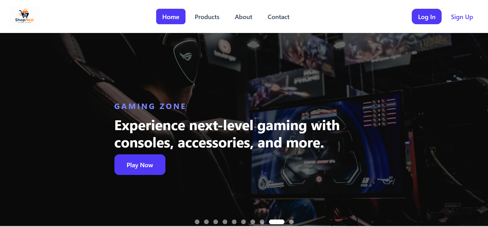
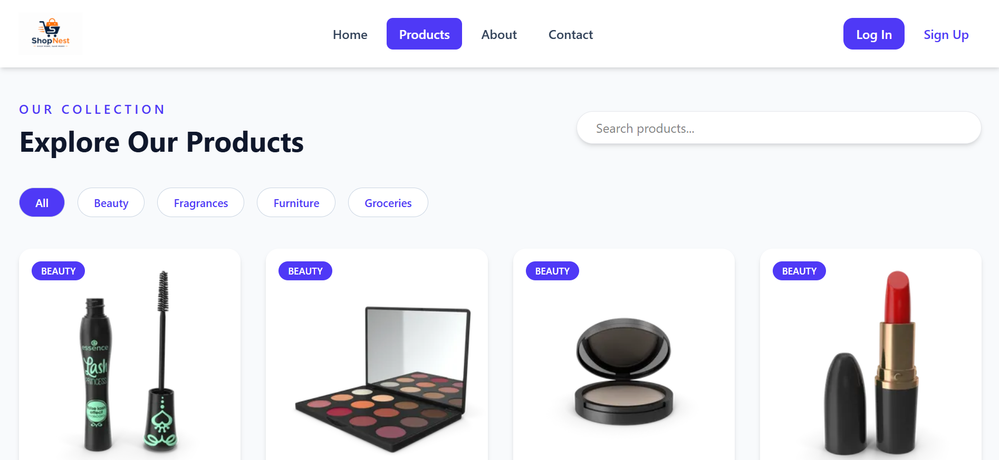

# 🛍️ ShopNest

ShopNext is a modern, responsive e-commerce frontend application built with **React.js** and **Tailwind CSS**. It provides a clean and user-friendly shopping experience with product browsing, category filtering, search functionality, and a responsive design optimized for all devices.

## 🚀 Features

- 🛒 Modern and responsive UI
- 🔍 Product search functionality
- 📂 Category-wise product filtering
- ❤️ Wishlist-ready UI
- 🛍️ Shopping cart interface
- 📱 Mobile-friendly design
- ⚡ Fast performance using React
- 🎨 Beautiful UI built with Tailwind CSS
- 🔄 Component-based architecture
- 🌐 React Router for seamless navigation

---

## 🛠️ Tech Stack

- **React.js**
- **JavaScript (ES6+)**
- **Tailwind CSS**
- **React Router DOM**
- **Vite**
- **HTML5**
- **CSS3**

---

## 📁 Project Structure

```
ShopNext/
│── public/
│── src/
│   ├── assets/
│   ├── components/
│   ├── pages/
│   ├── layout/
│   ├── data/
│   ├── App.jsx
│   ├── main.jsx
│── package.json
│── vite.config.js
│── README.md
```

---

## ⚙️ Installation

Clone the repository

```bash
git clone https://github.com/ManishKumar8292/shopnext.git
```

Navigate to the project directory

```bash
cd shopnext
```

Install dependencies

```bash
npm install
```

Start the development server

```bash
npm run dev
```

Open your browser and visit

```
http://localhost:5173
```

---

## 📸 Screenshots




## 🌟 Future Improvements

- User Authentication
- Wishlist Functionality
- Payment Gateway Integration
- Order History
- Dark Mode
- Product Reviews & Ratings
- Backend Integration
- Admin Dashboard

---

## 📱 Responsive Design

The application is fully responsive and works smoothly on:

- Desktop
- Laptop
- Tablet
- Mobile

---

## 🎯 Learning Outcomes

Through this project, I gained hands-on experience with:

- React Components
- React Hooks
- State Management
- Props
- React Router
- Tailwind CSS
- Responsive Web Design
- Component Reusability
- Modern UI Development

---

## 👨‍💻 Author

**Manish Kumar**

UI Developer | React Developer

GitHub: https://github.com/ManishKumar8292

LinkedIn: https://www.linkedin.com/in/manish-kumar-bb579a192

---

## ⭐ Support

If you like this project, don't forget to give it a ⭐ on GitHub.

---

## 📄 License

This project is created for learning and portfolio purposes.
